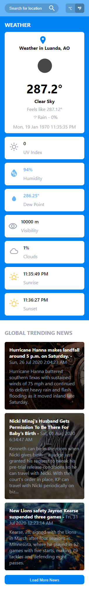

# [Supper Weather News](https:)

---

Supper weather news is a web application that gives to you the forecast according to desired place and best global trending news.

## Summary

1. [Features](#features)
2. [Made With](#made-with)
   1. [Tools](#tools)
   2. [Used APIS](#used-apis)
3. [Screenshots](#screenshots)
   1. [General Screens](#general-screens)
   2. [Responsive design](#responsive)
      1. [Small Devices](#small-devices)
      2. [Mobile](#mobile)
      3. [Tablet](#tablet)
      4. [Desktop](#desktop)

## Features {#features}

1. Search places functionality
2. Detect location functionality
3. Metric: Celsius vs imperial: Fahrenheit system (c vs f)
4. Current weather
5. Global Trending News

**Weather prevision includes:**

- Temperature
- UV Index
- Humidity
- Dew point
- Clouds
- Sunrise and Sunset

## Made with {#made-with}

### Tools {#tools}

- Written with [React JS](https://reactjs.org/)
- **CSS3** for styling.
- Icon took (_material design_ and _weather icons_) from React Icons.

### Used APIS {#used-apis}

I used some API's that I'd like to mention because they was very helpful for this project.

- [Open Weather Map](https://openweathermap.org/) for weather forecast and search places
- [NewsApi](https://newsapi.org/) for news about science

## Screenshots {#screenshots}

### General Screens

- Detect Location, Search for places and Metrics

  

  

### Responsive {#responsive}

#### **Small Devices** {#small-devices}

#### **Mobile** {#mobile}

#### **Tablet** {#tablet}

#### **Desktop** {#desktop}

